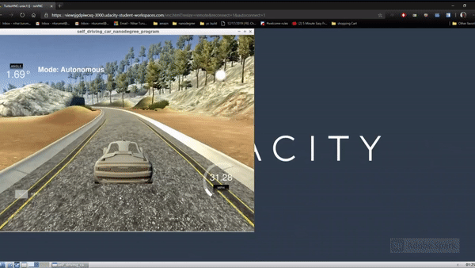

# CarND-Controls-PID
Self-Driving Car Engineer Nanodegree Program

---

## Dependencies

* cmake >= 3.5
 * All OSes: [click here for installation instructions](https://cmake.org/install/)
* make >= 4.1(mac, linux), 3.81(Windows)
  * Linux: make is installed by default on most Linux distros
  * Mac: [install Xcode command line tools to get make](https://developer.apple.com/xcode/features/)
  * Windows: [Click here for installation instructions](http://gnuwin32.sourceforge.net/packages/make.htm)
* gcc/g++ >= 5.4
  * Linux: gcc / g++ is installed by default on most Linux distros
  * Mac: same deal as make - [install Xcode command line tools]((https://developer.apple.com/xcode/features/)
  * Windows: recommend using [MinGW](http://www.mingw.org/)
* [uWebSockets](https://github.com/uWebSockets/uWebSockets)
  * Run either `./install-mac.sh` or `./install-ubuntu.sh`.
  * If you install from source, checkout to commit `e94b6e1`, i.e.
    ```
    git clone https://github.com/uWebSockets/uWebSockets 
    cd uWebSockets
    git checkout e94b6e1
    ```
    Some function signatures have changed in v0.14.x. See [this PR](https://github.com/udacity/CarND-MPC-Project/pull/3) for more details.
* Simulator. You can download these from the [project intro page](https://github.com/udacity/self-driving-car-sim/releases) in the classroom.

Fellow students have put together a guide to Windows set-up for the project [here](https://s3-us-west-1.amazonaws.com/udacity-selfdrivingcar/files/Kidnapped_Vehicle_Windows_Setup.pdf) if the environment you have set up for the Sensor Fusion projects does not work for this project. There's also an experimental patch for windows in this [PR](https://github.com/udacity/CarND-PID-Control-Project/pull/3).

## Basic Build Instructions

1. Clone this repo.
2. Make a build directory: `mkdir build && cd build`
3. Compile: `cmake .. && make`
4. Run it: `./pid`. 

Tips for setting up your environment can be found [here](https://classroom.udacity.com/nanodegrees/nd013/parts/40f38239-66b6-46ec-ae68-03afd8a601c8/modules/0949fca6-b379-42af-a919-ee50aa304e6a/lessons/f758c44c-5e40-4e01-93b5-1a82aa4e044f/concepts/23d376c7-0195-4276-bdf0-e02f1f3c665d)

## Editor Settings

We've purposefully kept editor configuration files out of this repo in order to
keep it as simple and environment agnostic as possible. However, we recommend
using the following settings:

* indent using spaces
* set tab width to 2 spaces (keeps the matrices in source code aligned)

## PID Controller

Taken from https://en.wikipedia.org/wiki/PID_controller

PID stands for Proportional, Integral, Differential controller. It calculates an error value, the difference between  the current value of process variable and the desired value.
$$
 {\displaystyle u(t)=K_{\text{p}}e(t)+K_{\text{i}}\int _{0}^{t}e(t')\,dt'+K_{\text{d}}{\frac {de(t)}{dt}},}{\displaystyle u(t)=K_{\text{p}}e(t)+K_{\text{i}}\int _{0}^{t}e(t')\,dt'+K_{\text{d}}{\frac {de(t)}{dt}},}
$$
 where the K's are the constants for the different parts.

Let us look at the three components individually.

1. #### Proportional: 

   As the name suggests, proportional control applies a correction directly proportional to the offest of the process variable from the desired variable. Higher values lead to faster convergence, however it also leads to higher oscillations. Basically think of a spring mass system with a high stiffness... Same behavior

   

2. ### Integral:

    Sometimes, there may be a constant error in the process intrinsic to the devices, this error is called steady state error. To counter this problem, we can introduce a correction, that is proportional to the total accumulation of error.  In a spring mass system, think that this corrections solves the problem of a spring that has a permanent stretch in it.

   

    

3. ### Differential:

   In a spring mass system, this would be the damping term, this dampens the oscillations and gets you to  a steady state.

   The magnitude of correction is directly proportional to the slope of the error. 

   

## Controllers used

There are two controllers used in this project, one for speed and one for angle.

The speed controller tries to get the car to the desired speed and the angle controller steers the car.

The error for the steer controller is obtained from the simulator.

The error for the speed  controller is obtained by taking the difference between the current speed and the desired speed.

The desired speed is:

```c++
double desiredSpeed = 40 - (10) * fabs(steer_value);
```

By Manual Tuning, we obtained the following weights (P, I, D):

Angle PID -->(0.3, 0.008, 3.5)

Speed PID --> (0.15, 0.0, 1.5)

We also limit the range of throttle and steer angle, the corrections, to values between -1 and 1

## Results

Car can make it through the track above the minimum required speed of 30 MPH (avg).




## Future Challenges

1. Implement Twiddle to obtain most optimum values.
2. Increase Speed

